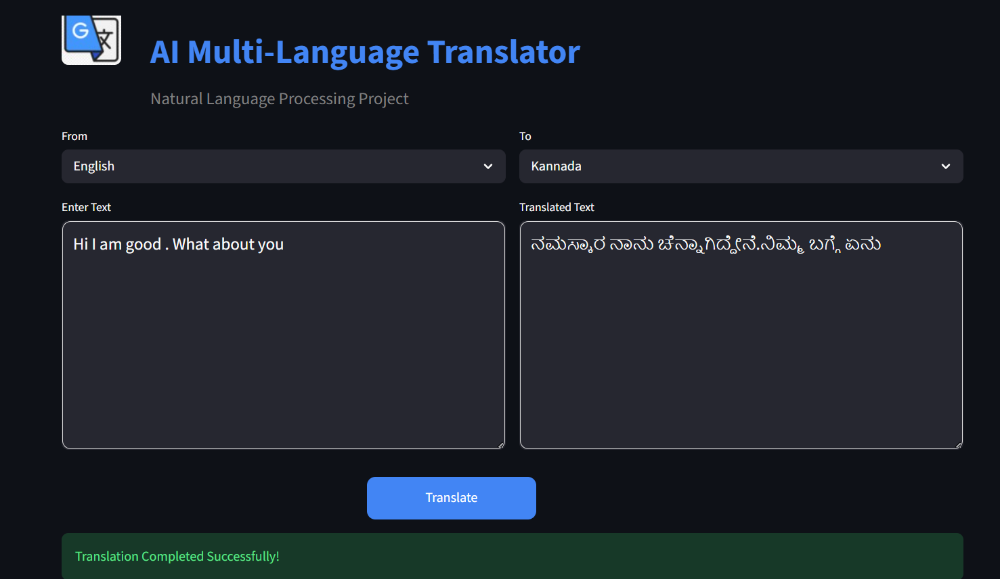

# 🌍 AI Multi-Language Translator



## 📖 Overview

The **AI Multi-Language Translator** is a web-based application developed using **Python** and **Streamlit** that enables users to translate text between multiple languages instantly. The application provides a clean, interactive, and user-friendly interface, making language translation simple and efficient.

This project demonstrates the integration of AI-powered language translation APIs with a modern web interface.

---

## 🚀 Features

- 🌐 Translate text into multiple languages
- 🔄 Automatic language detection
- 🎯 Simple and user-friendly interface
- ⚡ Real-time translation
- 📋 Copy translated text
- 💻 Responsive Streamlit application
- 🤖 AI-powered translation support
- 🎨 Clean and attractive UI

---

## 📸 Project Screenshot

### Home Page


---

## 🛠️ Technologies Used

| Technology | Purpose |
|------------|---------|
| Python | Backend Programming |
| Streamlit | Web Application Framework |
| Googletrans | Language Translation |
| OpenAI API | AI Integration (Optional) |
| HTML/CSS | UI Customization |

---

## 📂 Project Structure

```
AI_Multi_Language_Translator/
│
├── assets/
│   ├── logo.png
│   └── screenshots/
│       └── Translator.png
│
├── app.py
├── requirements.txt
├── README.md
└── 2.py
```

---

## ⚙️ Installation

### Clone the Repository

```bash
git clone https://github.com/gitcode/AI_Multi_Language_Translator.git
```

### Move into the Project Folder

```bash
cd AI_Multi_Language_Translator
```

### Install Required Packages

```bash
pip install -r requirements.txt
```

or

```bash
python -m pip install -r requirements.txt
```

---

## ▶️ Run the Application

```bash
streamlit run app.py
```

The application will start at

```
http://localhost:8501
```

---

## 📝 How to Use

1. Open the application in your browser.
2. Enter the text you want to translate.
3. Select the source language.
4. Select the target language.
5. Click the **Translate** button.
6. View the translated output instantly.

---

## 📦 Requirements

```
streamlit
googletrans==4.0.0rc1
python-dotenv
openai
```

---

## 🎯 Learning Outcomes

Through this project, the following concepts were learned:

- Python Programming
- Streamlit Application Development
- API Integration
- Language Translation APIs
- User Interface Design
- AI-Based Applications

---

## 🔮 Future Enhancements

- 🎤 Voice-to-Text Translation
- 🔊 Text-to-Speech
- 🌍 Support for 100+ Languages
- 📄 PDF Document Translation
- 📷 OCR Image Translation
- 🤖 AI Grammar Correction
- 💾 Translation History
- 🌙 Dark Mode

---

## 📊 Project Highlights

- Real-Time Translation
- AI-Powered Language Processing
- Interactive User Interface
- Lightweight and Fast
- Easy to Deploy
- Beginner Friendly

---

## 👨‍💻 Author

**Srajan M Kulal**

Artificial Intelligence & Machine Learning Student

GitHub:
https://github.com/srajankulal27-aiml

---

## ⭐ If you like this project

If you found this project useful, please consider giving it a ⭐ on GitHub.

---

## 📄 License

This project is developed for educational and learning purposes.